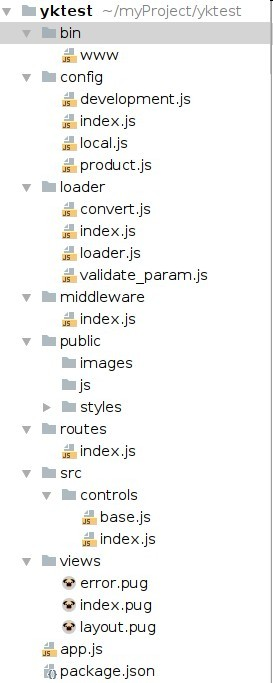

# yk-generator


## Installation

```sh
$ npm install -g yk-generator
```

## Quick Start
the way to get started with express to generate an application as shown below;

Create the app

```bash
$ yk /temp/yktest && cd /temp/yktest
```
Install dependencies;

```bash
$ npm i
```




